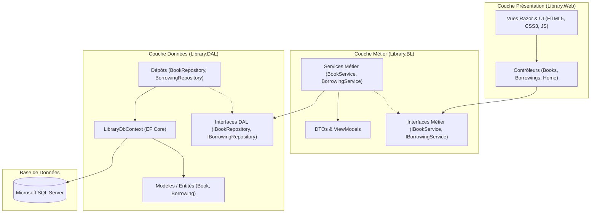

# 📖 Story Bloom — Système de Gestion de Bibliothèque

<div align="center">


<p align="center">
  <strong>Une application web élégante, robuste et moderne pour la gestion intégrale d'une bibliothèque.</strong><br>
  Développée en <strong>ASP.NET Core 8 MVC</strong> selon les principes d'une <strong>architecture en 3 couches (N-Tier)</strong> avec <strong>Entity Framework Core</strong> et <strong>SQL Server</strong>.
</p>

[Fonctionnalités](#-fonctionnalités-principales) • [Architecture](#-architecture-du-projet) • [Technologies](#-technologies--outils) • [Installation](#-guide-dinstallation-et-démarrage) • [Structure](#-structure-de-la-solution) • [Base de Données](#-base-de-données--seed-data)

---

</div>

## 🌟 Aperçu du Projet

**Story Bloom** est une solution complète conçue pour simplifier la gestion quotidienne d'une bibliothèque ou médiathèque. L'application offre une expérience utilisateur fluide et raffinée grâce à une interface soignée inspirée des beaux livres classiques (typographies *Playfair Display*, *Cormorant Garamond* et *DM Mono*, palette marine et dorée).

Elle permet aux gestionnaires de suivre en temps réel l'état du parc d'ouvrages, d'enregistrer les emprunts et les retours, de surveiller les retards et de consulter des indicateurs clés via un tableau de bord interactif.

---

## 🚀 Fonctionnalités Principales

### 📊 1. Tableau de Bord Analytique (Dashboard)
- **Statistiques clés en temps réel** :
  - Nombre total de livres catalogués.
  - Nombre d'exemplaires actuellement disponibles.
  - Emprunts en cours d'utilisation.
  - Alerte visuelle pour les **emprunts en retard**.
- **Accès rapide** aux derniers ajouts du catalogue et aux activités d'emprunt récentes.

### 📚 2. Gestion du Catalogue de Livres (CRUD)
- **Consultation et Recherche** :
  - Moteur de recherche multicritère (titre, auteur, genre, ISBN).
  - Navigation par **filtre alphabétique** (index A-Z).
  - Badges d'état dynamiques (*Disponible* / *Emprunté*).
- **Fiches Détaillées** :
  - Affichage complet des métadonnées (ISBN, Éditeur, Année de parution, Résumé).
  - Affichage de la couverture personnalisée.
  - Historique complet des emprunts passés et actuels pour chaque livre.
- **Ajout, Édition et Suppression** :
  - Formulaires avec validation stricte côté client et serveur (Data Annotations).
  - Téléversement d'image de couverture (Upload local géré dans `wwwroot/images/covers`).
  - Protection contre la suppression d'un livre actuellement prêté.

### 🔄 3. Gestion des Emprunts & des Retours
- **Nouveau prêt** :
  - Sélection assistée des livres disponibles.
  - Enregistrement des coordonnées de l'emprunteur (Nom, Email, Notes).
  - Calcul automatique de la date d'échéance (14 jours par défaut).
  - Mise à jour instantanée du statut du livre (`IsAvailable = false`).
- **Suivi et Alertes** :
  - Vue dédiée aux **Emprunts actifs** (`/Borrowings/Active`).
  - Vue dédiée aux **Emprunts en retard** (`/Borrowings/Overdue`) avec mise en évidence rouge.
- **Procédure de Retour** :
  - Enregistrement de la date effective de retour et de remarques éventuelles.
  - Remise en disponibilité immédiate du livre dans le catalogue.

---

## 🏛️ Architecture du Projet

Le projet adopte une **architecture en couches (3-Tier / N-Tier)** garantissant une séparation stricte des responsabilités (SoC - *Separation of Concerns*), la maintenabilité du code et l'extensibilité future :



### Détail des Couches :

1. **`Library.DAL` (Data Access Layer)** :
   - Contient les entités EF Core (`Book`, `Borrowing`).
   - `LibraryDbContext` avec configuration Fluent API et alimentation initiale (*Seed Data*).
   - Implémentation du pattern **Repository** (`BookRepository`, `BorrowingRepository`) pour abstraire l'accès aux données.
   - Migrations de base de données Code-First.

2. **`Library.BL` (Business Logic Layer)** :
   - Contient la logique d'application et les règles métier (vérification de disponibilité, calcul des retards, validation des retours).
   - Objets de transfert de données (**DTOs**) pour isoler le domaine de la couche présentation (`BookDto`, `CreateBookDto`, `BorrowingDto`, `DashboardDto`).
   - Services applicatifs (`BookService`, `BorrowingService`).

3. **`Library.Web` (Presentation Layer)** :
   - Application web **ASP.NET Core MVC** sous **.NET 8**.
   - Contrôleurs légers injectés via le conteneur d'IoC natif (`Program.cs`).
   - Vues Razor responsives et personnalisées avec intégration d'icônes et de composants modulaires.
   - Application automatique des migrations au démarrage de l'application (`db.Database.Migrate()`).

---

## 🛠️ Technologies & Outils

| Domaine | Technologie / Bibliothèque | Description |
| :--- | :--- | :--- |
| **Framework** | .NET 8.0 SDK | Plateforme open-source moderne haute performance |
| **Langage** | C# 12 | Langage fortement typé moderne |
| **Web Framework** | ASP.NET Core MVC | Modèle Modèle-Vue-Contrôleur |
| **ORM** | Entity Framework Core 8.0 | O/RM Code-First avec SQL Server Provider |
| **Base de Données** | Microsoft SQL Server / LocalDB | Système de gestion de base de données relationnelle |
| **Design / Frontend** | HTML5, CSS3 sur mesure, JavaScript | Typographie Google Fonts (*Playfair Display*, *DM Mono*), CSS Variables |
| **Injection de Dépendances** | DI Container natif .NET | Enregistrement `Scoped` des services et dépôts |

---

## 📁 Structure de la Solution

```plaintext
Library_Project_Complet/
├── LibraryDatabase/                   # Solution Backend & Accès aux Données
│   ├── LibraryDatabase.sln
│   ├── Library.DAL/                   # Couche d'Accès aux Données
│   │   ├── Context/                   # DbContext et DbContextFactory
│   │   ├── Migrations/                # Historique des migrations EF Core
│   │   ├── Models/                    # Entités Book & Borrowing
│   │   └── Repositories/              # Repositories & Interfaces (IBookRepository...)
│   └── Library.BL/                    # Couche Logique Métier
│       ├── DTOs/                      # Objets de transfert (BookDto, BorrowingDto...)
│       ├── Interfaces/                # Contrats des services (IBookService...)
│       └── Services/                  # Implémentation des règles métiers
│
└── LibraryWebApp/                     # Solution Web & Présentation
    ├── LibraryWebApp.sln
    └── Library.Web/                   # Application ASP.NET Core MVC
        ├── Controllers/               # BooksController, BorrowingsController, HomeController
        ├── Views/                     # Vues Razor (Books, Borrowings, Home, Shared)
        ├── wwwroot/                   # Fichiers statiques (CSS sur mesure, JS, Couvertures)
        ├── appsettings.json           # Chaîne de connexion et configuration
        └── Program.cs                 # Configuration du pipeline HTTP & Injections DI
```

---

## 📦 Guide d'Installation et Démarrage

### 1. Prérequis
Assurez-vous d'avoir installé sur votre machine :
- [.NET 8.0 SDK](https://dotnet.microsoft.com/download/dotnet/8.0) ou supérieur.
- [Visual Studio 2022](https://visualstudio.microsoft.com/) (avec la charge de travail *Développement web et ASP.NET*) ou [Visual Studio Code](https://code.visualstudio.com/) avec l'extension C# Dev Kit.
- [SQL Server](https://www.microsoft.com/sql-server/) ou **LocalDB** (fourni par défaut avec Visual Studio).

---

### 2. Cloner le Projet
```bash
git clone https://github.com/votre-utilisateur/Library_Project_Complet.git
cd Library_Project_Complet
```

---

### 3. Configuration de la Base de Données
Ouvrez le fichier `LibraryWebApp/Library.Web/appsettings.json` et adaptez la chaîne de connexion si nécessaire :

```json
{
  "ConnectionStrings": {
    "DefaultConnection": "Server=(localdb)\\mssqllocaldb;Database=LibraryDb;Trusted_Connection=True;MultipleActiveResultSets=true"
  }
}
```

> **Note :** L'application applique automatiquement les migrations de base de données et peuple le catalogue de démarrage à son premier lancement grâce à la méthode `db.Database.Migrate()` configurée dans `Program.cs`.

---

### 4. Lancer l'Application

#### Avec la CLI .NET :
```bash
# Se placer dans le répertoire du projet web
cd LibraryWebApp/Library.Web

# Restaurer les dépendances et exécuter
dotnet run
```

#### Avec Visual Studio :
1. Ouvrez le fichier de solution `LibraryWebApp/LibraryWebApp.sln`.
2. Définissez **`Library.Web`** comme projet de démarrage.
3. Appuyez sur `F5` ou `Ctrl + F5`.

L'application s'ouvrira automatiquement à l'adresse : `https://localhost:7123` (ou `http://localhost:5000`).

---

## 🗄️ Base de Données & Seed Data

La base de données est automatiquement pré-remplie avec des œuvres classiques de démonstration :

| Id | Titre | Auteur | Genre | Année | Statut initial |
| :---: | :--- | :--- | :--- | :---: | :---: |
| **1** | *Le Petit Prince* | Antoine de Saint-Exupéry | Littérature | 1943 | ✅ Disponible |
| **2** | *Les Misérables* | Victor Hugo | Roman historique | 1862 | ✅ Disponible |
| **3** | *L'Étranger* | Albert Camus | Roman philosophique | 1942 | 📕 Emprunté |
| **4** | *Madame Bovary* | Gustave Flaubert | Roman réaliste | 1857 | ✅ Disponible |

---

## 🔮 Perspectives d'Évolution (Roadmap)

- [ ] **Système d'Authentification & Rôles** : Intégration d'ASP.NET Core Identity (Administrateur, Bibliothécaire, Lecteur).
- [ ] **Rappels automatiques par Email** : Notifications automatisées pour les échéances d'emprunt approchantes et les retards.
- [ ] **Exportation des Données** : Export des listes de livres et d'emprunts au format Excel et PDF.
- [ ] **API RESTful & Swagger** : Exposition d'une Web API pour une intégration mobile ou externe.

---

## 👤 Auteur & Remerciements

Projet conçu et développé dans le cadre d'un système complet de gestion de bibliothèque.
N'hésitez pas à laisser une ⭐️ si vous appréciez le projet !

---

## 📄 Licence

Ce projet est sous licence libre [MIT](LICENSE). Vous êtes libre de l'utiliser, le modifier et le distribuer.
